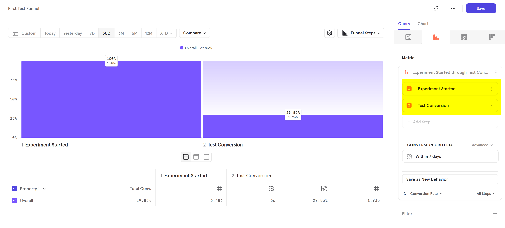
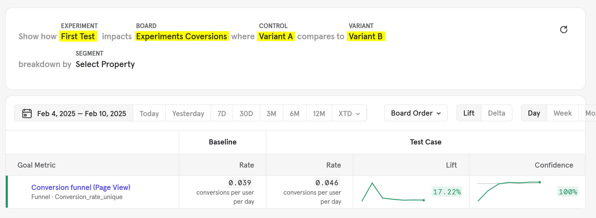

# Evaluating experiments in Mixpanel

1. Create a report that contains your data. A funnel report works great. Set the "Experiment Started" event as the first step and as a second step the conversion event you want to evaluate. You don't need to filter by an experiment yet.

2. Click in the applications menu in the top right corner and select "Applications", then "Experiments"
3. Select your experiment, the report you've just created and two variants

The example in the screenshot had an improved conversion rate by 17.22 for variant B with a confidence of 100%.

More information on experiment evaluation can be found in the [Mixpanel documentation](https://docs.mixpanel.com/docs/reports/apps/experiments)
