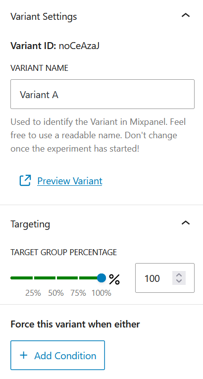
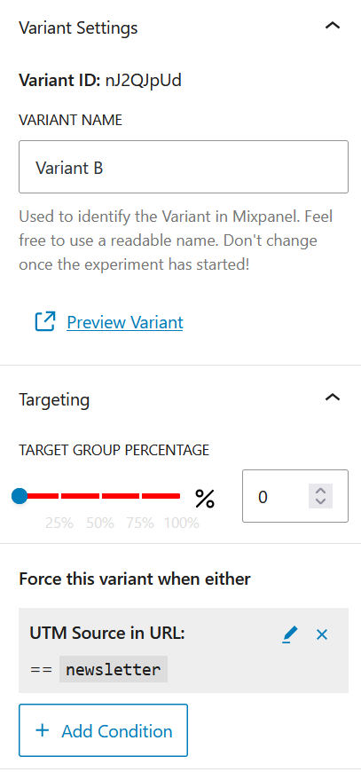

# Personalization

To create custom experiences and optimize your website content, you can create personalized content for multiple target groups.

## Example use case

Consider a landing page that receives traffic from social media and your newsletter. As a call to action, you'd like your social media audience to subscribe to the newsletter. But the audience arriving from your newsletter needs to see a different call to action.

## Force a different variant for newsletter audience

1. Create a content optimization as described in [Setting up an experiment](./setting-up-an-experiment.md), with:
   2. Variant A contains the call to action to subscribe to the newsletter
   3. Variant B contains a secondary call to action for people you know already receive the newsletter
2. Set Variant A to show for 100% of traffic, Variant B to 0%
3. For variant B, add a setting to force the variant when UTM Source is `newsletter`.

Forcing a variant has priority over random display of variants, it means that:

1. If the URL contains the UTM Source parameter `newsletter`, Variant B will be shown
2. If the URL doesn't contain this exact UTM source, no variant is forced and we fall back to showing the variants by weighted random. But because Variant A has 100% weight and Variant B 0%, it will always show Variant A.

## Advanced personalization

Audience targeting can be done in multiple ways. The example above uses UTM Source parameters in the URL, but any custom URL parameter could be used.

In addition, the plugin also allows localStorage and sessionStorage to be read for advanced use cases. These storage methods are more persistent than URL parameters, which change with each page, and can store a user's audience information over a longer period of time.

