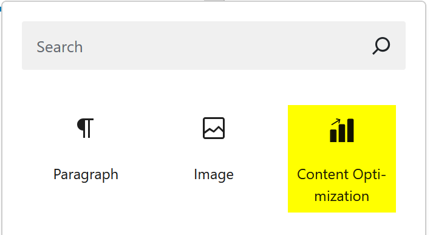
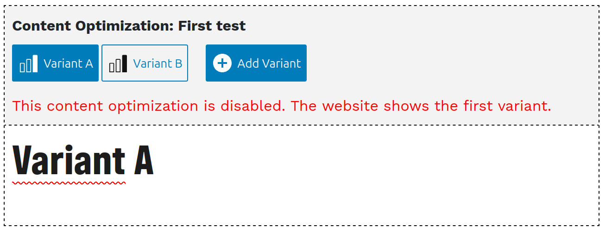
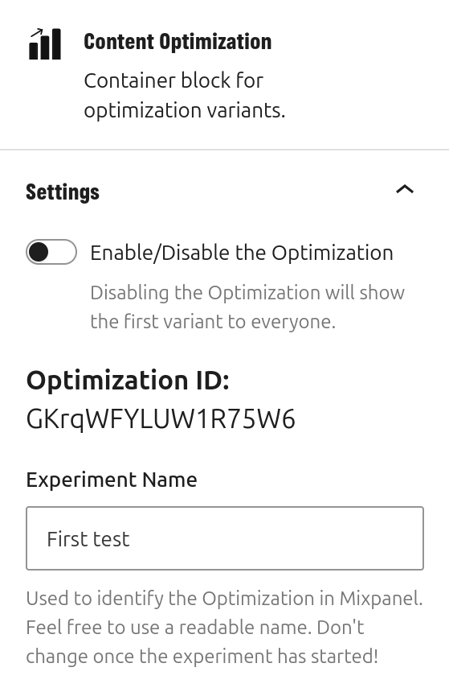
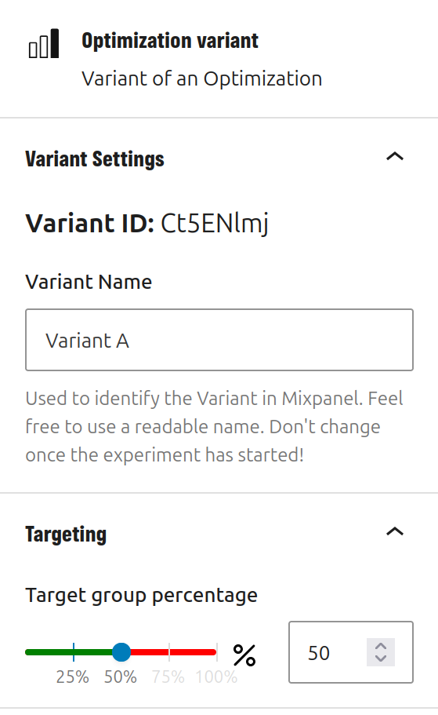

# Setting up an experiment

Create your post / page as usual. In the place you want to start your experiment, add a "Content Optimization" block.

Use the buttons to switch between variants. Add content to each variant.

The sidebar has additional settings, both for the overall experiment (make sure to select the outer block called "Content Optimization) and for each variant (click the buttons to select them).

In the overall experiment settings, you can:

- Choose a name for your experiment. This name is the identification of your experiment in Mixpanel. Make sure to choose something unique.
- Enable/disable the experiment. When the experiment is disabled, all users will see the first variant in the list.

In the settings for each variant, you can:

- Set a name for your variant. This name is the identification of the variant in Mixpanel.
- Set percentage how many users you would like to target with this variant.

The targeting works by calculating a weighted random value. If your target percentages don't add up to 100%, the actual size of the target group will be calculated using this formula: `100 / totalOfAllPercentages * variantPercentage`.
