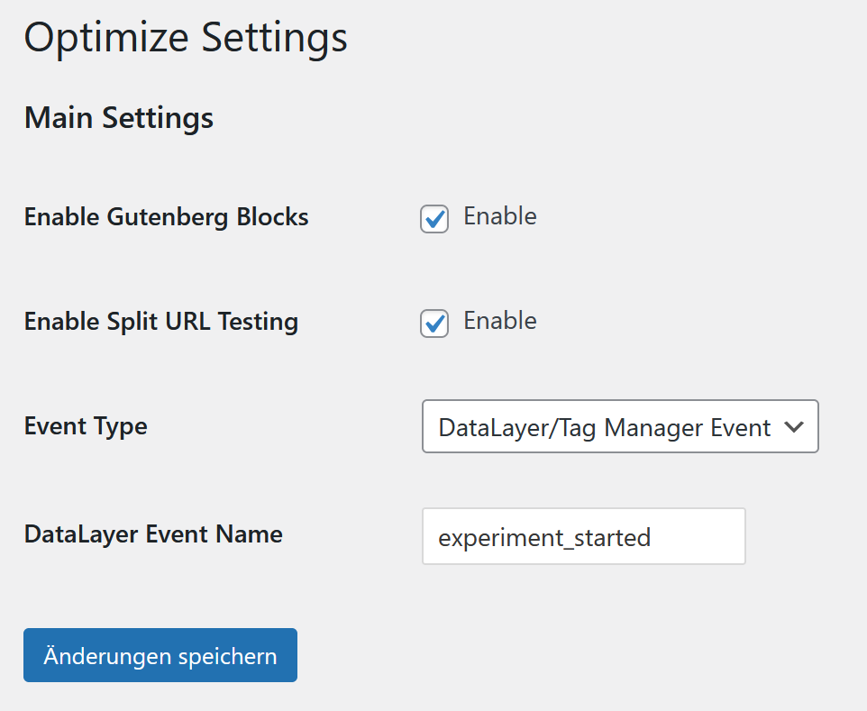
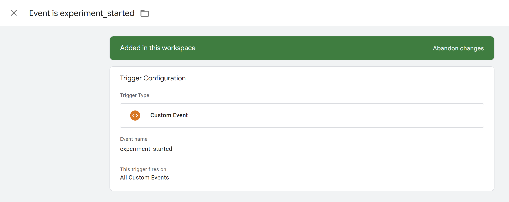
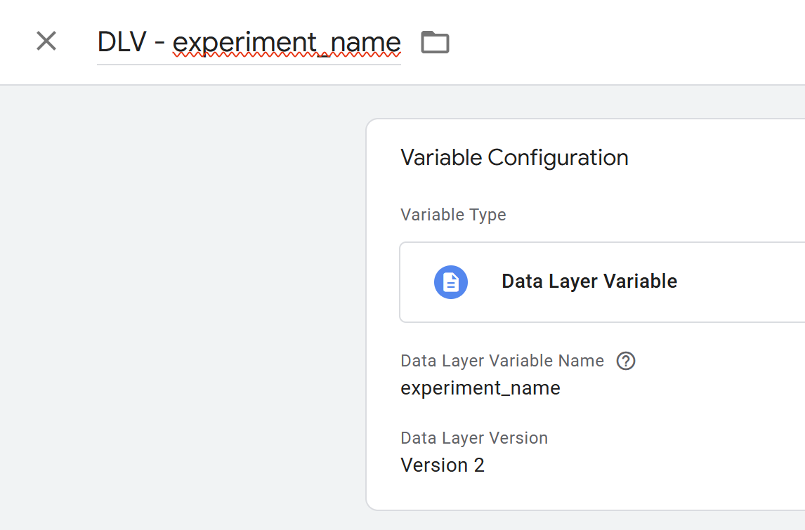
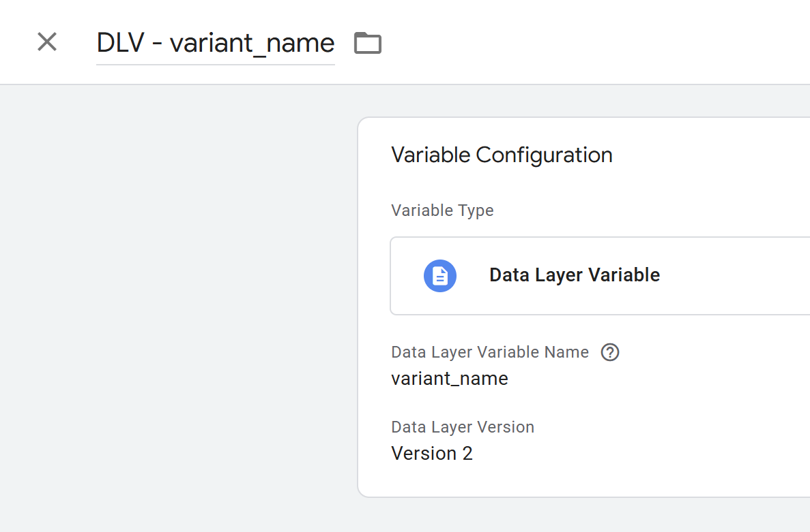
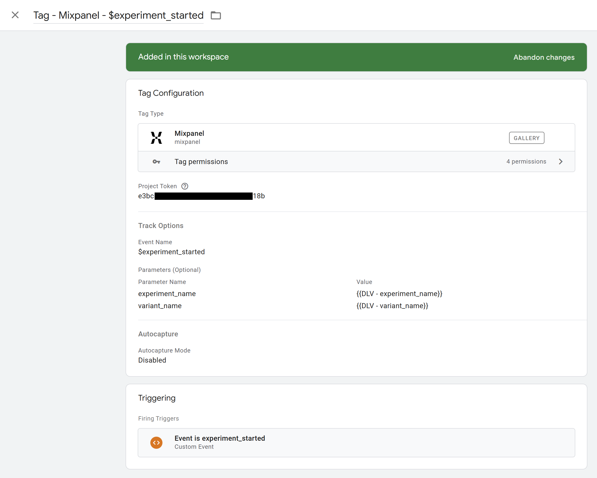

# Setup

## Prerequisites

- A running WordPress or Planet4 website
- Mixpanel is set up in your website either using the JavaScript SDK or through tag manager (server-side or client-side)

## Installation in Planet4

In your `composer-local.json` file, add the plugin in the `require`section:

```json
{
	[...]
	"require": {
		[...]
		"greenpeace/planet4-gpch-plugin-optimize": "*"
	},
	[...]
}
```

You can install a specific version instead of the latest one by replacing `*` with [any available version](https://packagist.org/packages/greenpeace/planet4-gpch-plugin-optimize).

To install the plugin to your development environment only, add it to `development.json` instead of `composer-local.json`

## Installation in any other Wordpress website

Download the plugin directly from [its Github Repository](https://github.com/GreenpeaceSchweiz/planet4-gpch-plugin-optimize):

1. Click the dropdown above the files list where it says "main"
2. Switch to the tab "Tags" and select the latest version
3. Click the green "Code" button on the right and "Download Zip"
4. In your WordPress admin, go to "Plugins" and upload the zip file

## Settings

In your WordPress admin, go to the "Optimize" settings page.



You can separately enable/disable the use of the Gutenberg block (in-content optimizations) and split URL testing.

**Event Type:** If Mixpanel is installed on your website using the JavaScript SDK, select it from the dropdown. If your events are routed through a tag manager that supports dataLayer (e.g. Google Tag Manager), select that option.

**DataLayer Event Name:** Set the name for the event that's pushed to dataLayer. Default is `experiment_started`.

## Mixpanel/Web analytics setup

To be able to evaluate your experiments in Mixpanel, this plugin sends an event every time an experiment runs on the website. The setup for it depends on how Mixpanel is installed on your website.

### Using the Mixpanel JavaScript SDK

If you are using the [Mixpanel Javascript SDK](https://docs.mixpanel.com/docs/tracking-methods/sdks/javascript) on your website, all you have to do is set "Event Type" to  "Mixpanel JavaScript SDK Event". The plugin now starts tracking the experiments in Mixpanel using the `$experiment_started` event.

### Using Google Tag Manager

If you are using Google Tag Manager only to inject the Mixpanel JavaScript SDK into the `<head>` of your page, you can also set the "Event Type" setting as if you were using the JavaScript SDK directly.

For more flexibility, you can push the event data to dataLayer and handle sending the event to Mixpanel from Tag Manager:

1. In this plugin's settings, set "Event Type" to "Data Layer/Tag Manager Event"
2. In the same place, set "DataLayer Event Name". The default value is `experiment_started`
3. Go to Google Tag Manager and add a new trigger for the event

4. Add two data layer variables, `experiment_name` and `variant_name`


5. Add a tag. Depending on your setup, you may want to use a different one. You can send data directly to Mixpanel using a Mixpanel tag (imported from the gallery) or you can use a GA4 event to send event data to a server-side tag manager. It's likely that you already have other events set up, follow the same logic.

Here's an example for a Mixpanel tag:



Make sure you can see the incoming events in Mixpanel!

Any conversion events you want to use to evaluate your experiments in Mixpanel also have to be set up (e.g. form submissions, donations)
