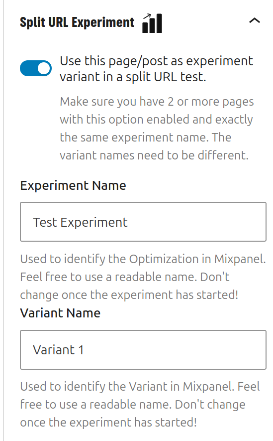

# Using split URL tests

If setting up variants inside of a content block is not practical, split URL testing provides a more flexible approach. For example in cases where full page layouts are used as variants, split URL testing can be helpful.

Start by creating the two pages or posts you want to test. Then in each of the pages, open the sidebar panel "Split URL experiment".
You can set:

- Enable or disable the experiment
- An experiment name. This identifies your experiment in Mixpanel. **Make sure the experiment name is exactly the same in all of the pages in your split URL test!**
- The variant name.  This name is the identification of the variant in Mixpanel. **Make sure the variant name is different for all of your pages!**

Then send traffic to the pages you've created. Currently, the plugin does not have functionality to split traffic. You need to split traffic using a newsletter or through links to your content.

